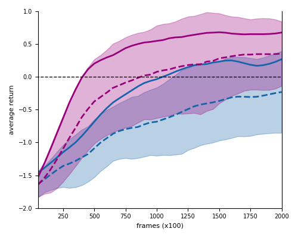
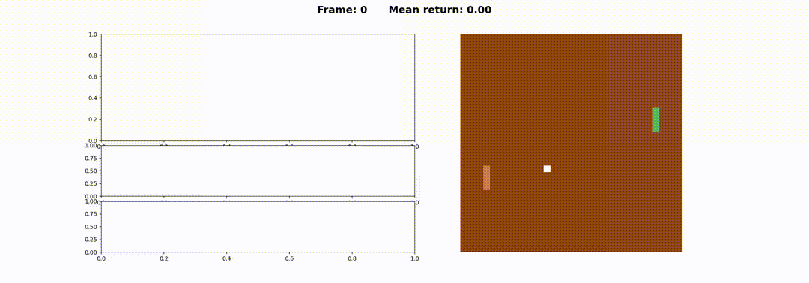
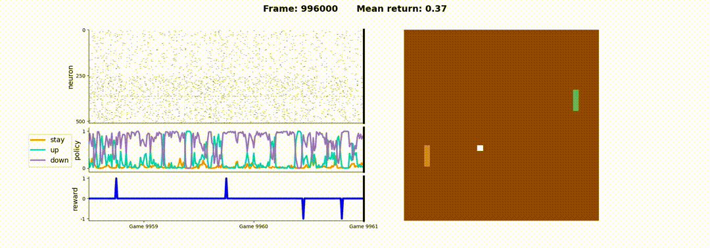

# Neuromorphic Dreaming: A Pathway to Efficient Learning in Artificial Agents

This repository contains the Python code for the paper "Neuromorphic Dreaming: A Pathway to Efficient Learning in Artificial Agents" ([arXiv:2405.15616](https://arxiv.org/abs/2405.15616)). It implements a model-based reinforcement learning (MBRL) approach using spiking neural networks (SNNs) running directly on the DYNAP-SE mixed-signal neuromorphic processor to learn the Atari Pong game.

## Overview

The project demonstrates how biologically inspired "dreaming" (offline learning using a world model) can improve sample efficiency in reinforcement learning when implemented on energy-efficient neuromorphic hardware. The core idea involves alternating between:

1.  **Awake Phase:** The SNN agent interacts with the real Pong environment (via OpenAI Gym), learning from actual rewards using a policy gradient rule. The world model SNN learns to predict environment transitions.
2.  **Dreaming Phase:** The agent interacts with the learned world model SNN, generating simulated experiences and further refining its policy based on predicted rewards.

Both the agent and world model SNNs leverage the analog neuron and synapse dynamics of the DYNAP-SE chip for computation, with only the final readout layers trained on a host computer. The primary performance comparison is visualized in `results/comparison_10.png`.



## System Requirements

*   **Hardware:** Access to **DYNAP-SE neuromorphic hardware** is required for execution.
*   **Operating System:** Tested primarily on **Ubuntu 16.04 LTS**. Compatibility with other operating systems is not guaranteed due to potential hardware driver and `samna` library dependencies.
*   **Python:** Tested with Python 3.x (specifically 3.8+ for `scipy.stats`).

## Dependencies

*   `samna==0.17`: Library for interfacing with DYNAP-SE.
*   `numpy`
*   `matplotlib`
*   `scipy` (for statistical analysis script)
*   `gymnasium` (with Atari support)
*   `tqdm`

It is recommended to use a Python virtual environment. You can typically install standard Python dependencies via pip (installation time: typically < 5 minutes):
`pip install numpy matplotlib scipy gymnasium[atari] gymnasium[accept-rom-license] tqdm`


## Files

*   `agent.py`: Main `PongAgent` class implementing the SNN agent/model logic, learning rules, DYNAP-SE interaction.
*   `optimizer.py`: Adam optimizer implementation.
*   `params.py`: Network parameter settings (loaded from `config.ini`).
*   `functions.py`: Utility functions for plotting detailed results (rewards, policies, spikes).
*   `train.ipynb`: Jupyter Notebook for hardware connection, agent configuration, and running the training loop.
*   `config.ini`: Configuration file (learning rates, neuron counts, etc.).
*   `results/`: Contains averaged reward data (`.npy` files) from training runs. **Also contains the main comparison plot `comparison_10.pdf`.**
*   `compare_results.py`: Script to **generate** the main comparison plot (`results/comparison_10.pdf`, similar to Fig 1a in the paper) from data in `results/`.
*   `calculate_stats.py`: Script to perform the **Mann-Whitney U statistical test** comparing final performance between dreaming and no-dreaming runs, using data in `results/`.
*   `LICENSE`: MIT License file.
*   `README.md`: This file.

## Running the Training

1.  Ensure DYNAP-SE hardware is connected and `samna` library is functional.
2.  Set up your Python environment and install dependencies (including `scipy`).
3.  Open and run the cells sequentially in `train.ipynb`.
    *   Connect to the DYNAP-SE board.
    *   Create and configure the `PongAgent` (set `if_dream=True` or `False`).
    *   Execute the training loop.
4.  Outputs (averaged rewards, weights) are saved to a new directory (or potentially overwrite files in `results/` depending on your notebook implementation).
5.  Use `functions.py` for detailed plots, or `compare_results.py` / `calculate_stats.py` for summary analysis.

**Expected Runtime:** Running the initial setup cells in `train.ipynb` and completing a full 2000-game training run on our test setup (Intel i7-6700K CPU host) took approximately **1 hour** when training *without* dreaming, and approximately **3 hours** when training *with* the dreaming phase included (100 awake + 50 dreaming frames per game).

## Demo Videos

Short previews showing the agent's behavior at the start and end of training. Click the links below the previews for the full videos.

**Start of Training (Random Policy):**


*([Link to full start_training.mp4 video](media/start_training.mp4))*

**End of Training (Learned Policy):**


*([Link to full end_training.mp4 video](media/end_training.mp4))*

## Configuration

Adjust parameters in `config.ini`. Note: Significant changes to network size might require code modifications due to DYNAP-SE hardware constraints (fan-in, core size).

## Generating Comparison Plots & Statistics

1.  Ensure result `.npy` files (format: `rewards_{repetition}if_dream_{True/False}.npy`) are in the `results/` folder.
2.  To generate the main performance plot (Mean±SD, 80th percentile):
    `python compare_results.py`
    *(Output: `results/comparison_10.pdf`)*
3.  To calculate descriptive statistics and perform the Mann-Whitney U test on final performance:
    `python calculate_stats.py`
    *(Output: Printed statistics including Mean, SD, U-statistic, p-value)*

## License

This project is licensed under the MIT License - see the [LICENSE](LICENSE) file for details.

## Citation

If you use this code or find our work relevant, please cite:

```bibtex
@misc{blakowski2024neuromorphicdreamingpathwayefficient,
      title={Neuromorphic dreaming: A pathway to efficient learning in artificial agents},
      author={Ingo Blakowski and Dmitrii Zendrikov and Cristiano Capone and Giacomo Indiveri},
      year={2024},
      eprint={2405.15616},
      archivePrefix={arXiv},
      primaryClass={cs.AI},
      url={https://arxiv.org/abs/2405.15616},
}
```

## Acknowledgements

This work utilizes the DYNAP-SE neuromorphic chip and the `samna` library from SynSense. The Pong environment is provided by OpenAI Gymnasium. Parts of the code structure reuse elements from Capone et al.'s `biodreaming` repository ([https://github.com/cristianocapone/biodreaming](https://github.com/cristianocapone/biodreaming)). We acknowledge financial support detailed in the main manuscript.
